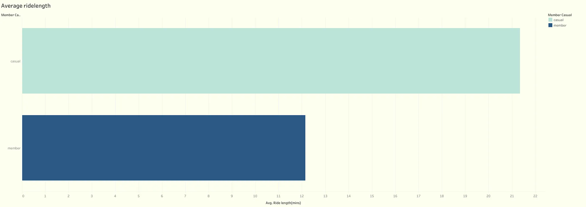
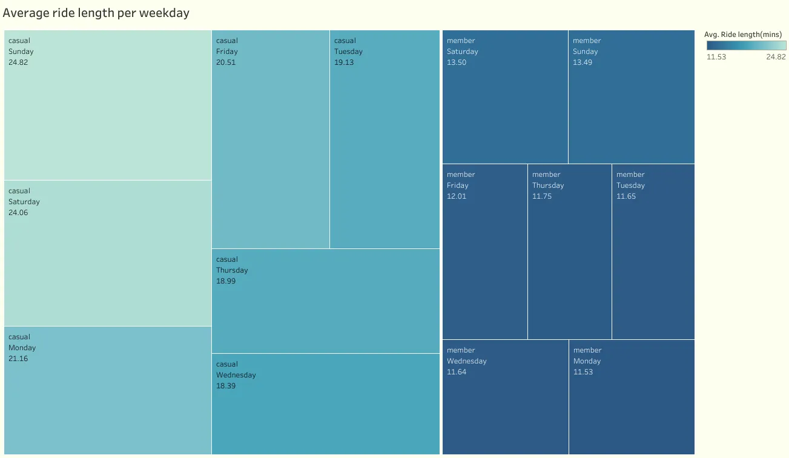
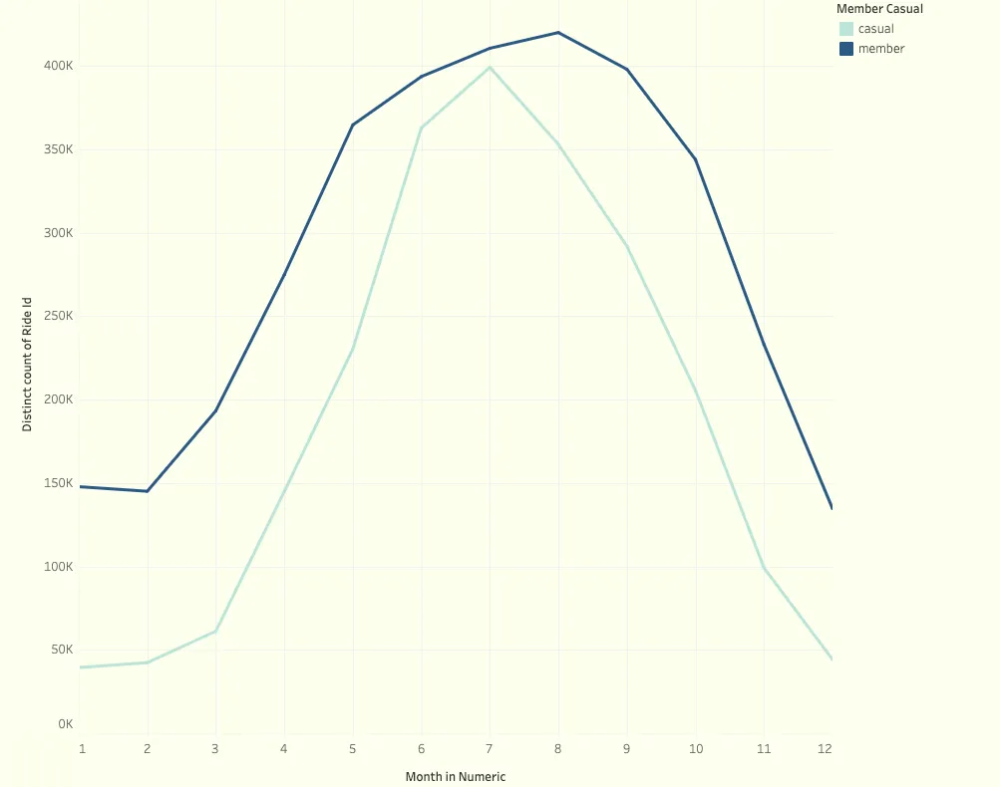
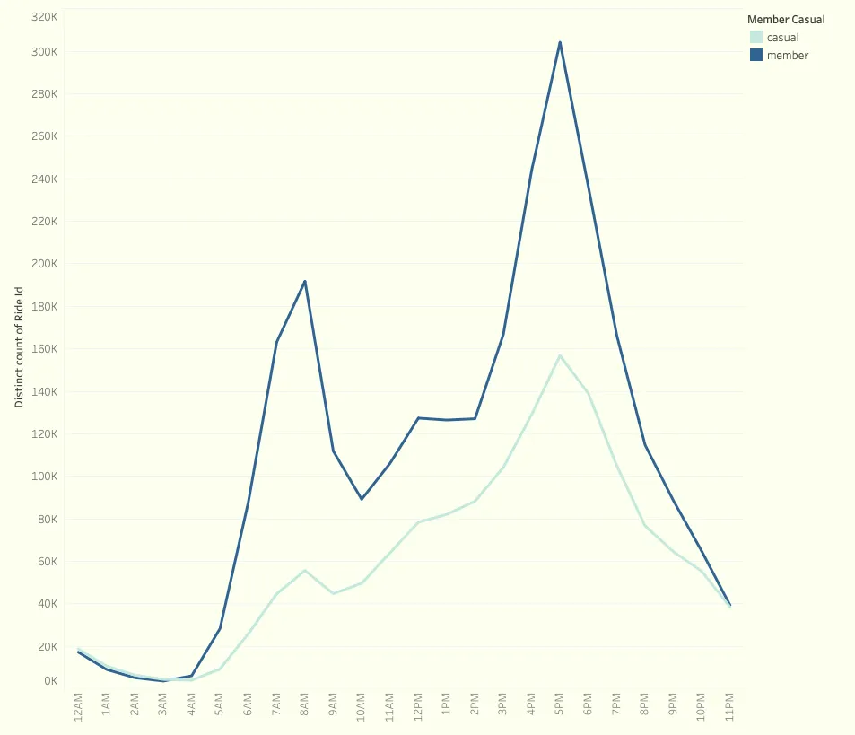
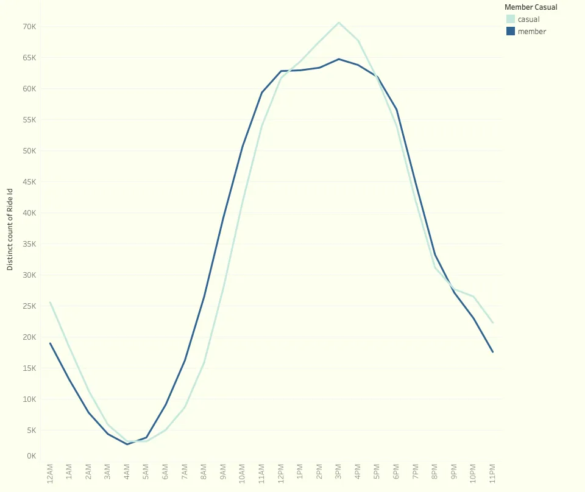
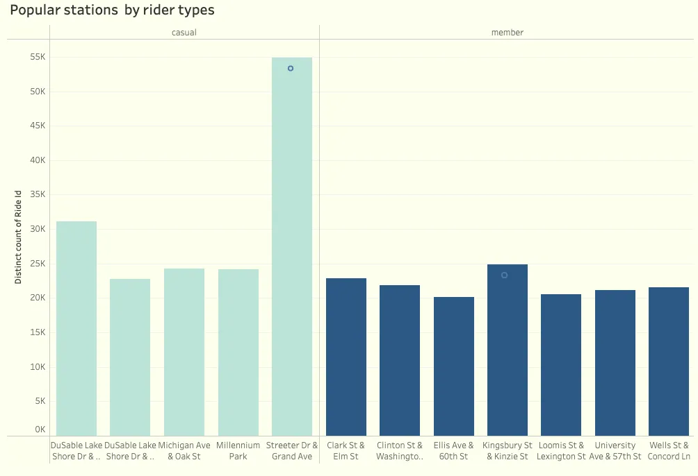

# Google Data Analytics CaseStudy1(Cyclistic Dataset)

## Introduction

This a Tableau project on Customer analysis for a bike sharing company (Cyclistic).The project is to analyze how their customer make use of their products and derive insights to help the marketing team make data driven decisions.

**Disclaimer: All dataset and  reports do not present any company institution or country  but just a dummy dataset**

## Problem Statement 

1.	How annual members and casual riders use cyclistic bikes differently 
2.	Why would casual members upgrade to annual membership 
3.	How can cyclistic use digital media to influence casual riders to become members

  
## Skills Demonstrated 

Data cleaning, Data manipulation, calculated fields, extract function

## Data Source

We will be using Cyclistics historical trip data [here](https://divvy-tripdata.s3.amazonaws.com/index.html) from 2022 June till 2023 May (202206-divvy-tripdata.zip -> 202305-divvy-tripdata.zip). The data has been made available by Motivate International Inc. under this [license](https://www.divvybikes.com/data-license-agreement).

The dataset comprises several key attributes that contribute to the understanding of Cyclistic’s operations

- Ride_id field -Unique identifiers for riders, 
- Bike_types- ,
- Start times- Precise start time for each trip,
- End time - Precise endtime for each trip,
- Start station -Station where trip started,
- End station -Station where trip ended,
- Rider types -categorizing riders based on casual or annual members

## Data Transformation 

Two new columns were generated 

**Ride length** - Duration it took riders to complete their trips ,It was derived by calculating the time difference between the start and end timestamps for each trip

**Day of the week** – Provide specific day each trip occurred ,we employed the Extract function on the “start_at” column, enabling us to isolate the weekday component.

In other to process the 5,733,072 total records, spreadsheets wouldn’t be able to handle that amount of data, that was why I opted to use tableau .
Individual files from the past 12months were imported into tableau  and merged using union function in tableau .
Some of the columns had to converted to measures in other to leverage  aggregation functions and perform in-depth analysis ,This conversion process involved transforming these columns from their original format into numeric values that could be used for calculations and aggregations.
We encountered a day of the week column represented in numeric format. To enhance the readability and interpretation of this column, we employed a calculated field within our analysis tool and converted it into a string format, specifically representing the weekday.

## Analysis and Visualization 
In this phase, our objective is to conduct data analysis in order to address the business question assigned by Moreno: “How do annual members and casual riders use Cyclistic bikes differently ?” To accomplish this, we have divided the analysis process into the following steps:
1.	Examination of ride duration for each rider type.
2.	Calculation of the average ride length on each weekday.
3.	Determination of the number of riders per month.
4.	Analysis of the hourly bike usage patterns.
5.	Identification of the most frequently used stations by riders.

## Examination of ride duration
We needed to explore the relationship between rider type and ride length, specifically the proportion of total rides represented by each rider type. 

From the visual representation, it is evident that casual riders had a higher average ride length compared to annual member riders.
From the above visualization, the average ride length for annual members is **12.144 minutes while that of casual riders is 21.347 minutes**, which is almost double of annual members 

## Average ride length on each weekday
This visualization presents the mean ride duration per weekday categorized by customer type. It is worth noting that casual riders display significantly longer rides, with their durations almost twice as long as those of member riders. From this observation we could imply that casual riders primarily use the bikes for recreational purposes ,the stability in average duration for annual members could suggest that they make use of bikes for an activity they carry out on a daily basis .

## Number of riders per month

Our observation revealed that both casual riders and annual members experienced peak trip counts during the summer season, followed by a decrease in the following months. This trend suggests a correlation with weather conditions and leads us to formulate a hypothesis that the majority of riders are not high school students. This inference is further supported by the fact that summer season coincides with the typical break period for students.

## Hourly bike usage
### Weekdays

We discovered interesting patterns in the trip behavior of annual member riders. Notably, there was a prominent surge in the number of trips during the early morning hours, suggesting a strong association with commuting to work. Additionally, we observed a substantial increase in trip volume during the midday, aligning with the lunch hour. This indicates that annual members also utilize the bike-sharing service for their lunchtime activities.
Moreover, our analysis revealed a peak in usage at 5pm, coinciding with the typical office closing hours. This suggests that many annual member riders rely on the bike-sharing service for their commute back home after work.

### Weekend
 

We uncovered intriguing patterns in the trip behaviour of casual riders, shedding light on their weekend preferences. 
Notably, we observed a significant surge in trip activity during weekends, indicating a distinct usage pattern compared to other days of the week.

Specifically, our analysis revealed a remarkable peak in trip activity among casual riders during the afternoon hours on weekends. This suggests that casual riders are particularly active during this time, engaging in various recreational or leisure activities.

## Frequently used stations by riders
Through our comprehensive data analysis, we have gained valuable insights into the preferences and usage patterns of our casual and annual members in terms of bike station selection.
Our analysis indicates that casual members predominantly opt for the **Streeter Dr & Grand Ave bike rental station**, which is strategically located near the coastline of Chicago. This bike station’s proximity to Jane Addams Memorial Park, a popular leisure destination along the coastline, suggests that casual members are drawn to this location for their recreational activities.
Conversely, our data reveals that annual members primarily rely on the **Kingsbury St & Kinzie St bike rental station**, strategically situated in the central region of the commercial areas. The close proximity of this bike station to the commercial centres implies that annual members utilize these bikes for their daily commuting needs, likely to and from their workplaces.

*N.B: Null values in start_station_name were excluded*

## Conclussions and Recommendations
Our data analysis reveals a clear trend wherein casual riders demonstrate higher frequency of utilizing Cyclistic bikes compared to annual members. However, significant efforts are required to effectively persuade casual riders to transition into annual memberships.To achieve this ,I would recommend the following :

1. Leveraging the insights from our data analysis on peak usage patterns among riders, we can implement a priority bike usage and parking policy tailored for annual members. This policy would grant annual members unrestricted access to the bikes throughout the day, ensuring their convenience during all hours. Simultaneously, casual riders would benefit from easy access to the bikes during off-peak hours, promoting a balanced distribution of bike availability.
2. Offering attractive pricing plans and competitive rates that incentivize casual riders to commit to a longer commitments.
   
A marketing strategy that can be used to convert casual riders to annual members :

1.  Launch referral programmes to encourage annual members to spread the word by offering incentives like free ride credits to both the referring member and the new member they bring in.
2.  Streeter Drive & Grand Avenue bike station is mostly used by casual riders so the focus of advertising should be on promoting the advantages of annual membership to individuals in the vicinity of the Streeter Drive & Grand Avenue bike station, while marketing efforts should be directed towards weekends.
    
 **Additional remarks**
 
 The presence of a unique user ID among riders may impact the marketing strategy. Analyzing the frequency of bike usage by riders can help determine whether they are primarily tourists or local community members who regularly use the bikes. Convincing a tourist to become a member may pose a significant challenge.

